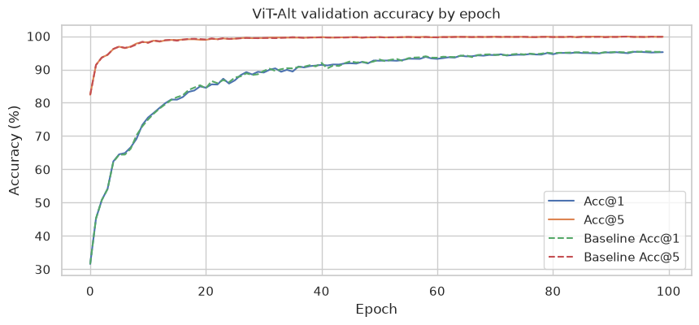
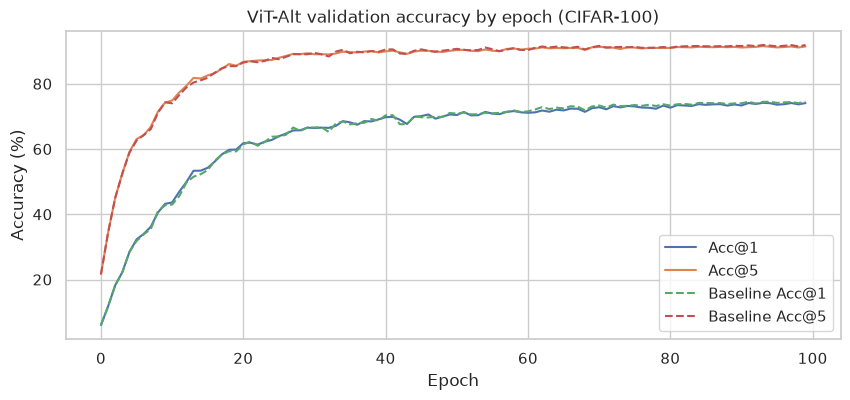

# Reproduction - Depth-Wise Convolutions in Vision Transformers for Efficient Training on Small Datasets

Ruifang Zhang | 6380751 | Reproduced  
Guotao Gou | 6380743 | Ablation study  
Radoslaw Majer | 5699975 | New algorithm variant

## Introduction

Vision Transformers (ViTs) have become a standard architecture for image classification, but they are often less data-efficient than convolutional networks when trained from scratch on small datasets. Unlike CNNs, vanilla ViTs process an image as a sequence of patch tokens and rely mainly on self-attention and positional embeddings to learn spatial structure. This makes them powerful on large-scale datasets, but it also means that they have weaker built-in local inductive bias.

The paper *Depth-Wise Convolutions in Vision Transformers for Efficient Training on Small Datasets* addresses this limitation by adding lightweight depth-wise convolution (DWConv) shortcuts to ViT blocks. The motivation is that the self-attention pathway can model global relationships while the DWConv shortcut preserves local spatial information on the patch grid. The authors report that this modification improves ViT performance on several classification datasets, especially in small-data settings such as CIFAR-10 and CIFAR-100.

In this project, we reproduce and extend the paper's main small-dataset classification claim. We first compare vanilla ViT-Tiny with ViT-Tiny + DWConv on CIFAR-10 and CIFAR-100 under a reduced single-GPU training budget. Because the original paper used 300 epochs and four P100 GPUs, our goal is not exact numerical reproduction. Instead, we test whether the qualitative effect remains: DWConv should improve ViT-Tiny accuracy relative to the baseline.

We then perform two additional studies. First, we run a positional-embedding ablation to test whether DWConv reduces the model's dependence on learned positional information. Second, we evaluate a small architectural variant in which the DWConv shortcut is multiplied by a learned per-layer fusion weight. Together, these experiments evaluate both the reproducibility of the reported accuracy gains and the proposed explanation that DWConv provides useful local spatial bias for training ViTs on small datasets.

This project uses the existing-code reproduction route. We did not reimplement the full method from scratch; instead, we evaluated and extended the available implementation. We therefore address three reproducibility criteria in the same order as the report: reproduced, ablation study, and new algorithm variant. These criteria were chosen because they test both the reported empirical effect and the proposed explanation that DWConv provides useful local spatial inductive bias.

## Results Reproduction

### Experimental Question

Does DWConv improve ViT-Tiny classification accuracy on CIFAR-10 and CIFAR-100 under a reduced training budget?

### Experimental Setup

We evaluated four runs: a vanilla ViT-Tiny baseline and a ViT-Tiny with DWConv shortcuts on each dataset. The official implementation always enabled DWConv, so we added a configuration flag, `USE_DWCONV`, that disables the shortcut without changing the remaining model or training pipeline. This produced a controlled comparison in which the intended architectural difference was the presence of DWConv.

All four models were trained from scratch for 100 epochs with a batch size of 128 and random seed 0. Input images were resized to $224 \times 224$. We retained the paper's AdamW optimizer, base learning rate of $5 \times 10^{-4}$, cosine learning-rate schedule, and data-augmentation pipeline. The original paper trained for 300 epochs on four P100 GPUs. Consequently, our experiment is a reduced-budget trend reproduction rather than an attempt to match the published accuracies exactly.

### Classification Accuracy

**Table 1. Published and reproduced best top-1 classification accuracies. Training time is reported as hours:minutes:seconds.**

| Dataset | Model | Paper Acc@1 | Our Acc@1 | Difference | Time |
|---|---|---:|---:|---:|---:|
| CIFAR-10 | ViT-Tiny | 94.01 | 90.95 | $-3.06$ | 2:18:28 |
| CIFAR-10 | ViT-Tiny + DWConv | 96.41 | 94.72 | $-1.69$ | 2:33:12 |
| CIFAR-100 | ViT-Tiny | 73.68 | 67.16 | $-6.52$ | 2:17:57 |
| CIFAR-100 | ViT-Tiny + DWConv | 78.05 | 74.73 | $-3.32$ | 2:37:07 |

The reproduced absolute accuracies are below the values reported in the paper, which is expected because we used only one third of the original training epochs. Nevertheless, the central comparison is consistent across both datasets. On CIFAR-10, DWConv increases best top-1 accuracy from 90.95% to 94.72%, an improvement of **3.77 percentage points**. On CIFAR-100, it increases accuracy from 67.16% to 74.73%, an improvement of **7.57 percentage points**.

**Table 2. Accuracy gain from adding DWConv to ViT-Tiny.**

| Dataset | Paper DWConv gain | Reproduced DWConv gain |
|---|---:|---:|
| CIFAR-10 | $+2.40$ | $+3.77$ |
| CIFAR-100 | $+4.37$ | $+7.57$ |

The direction of the effect therefore reproduces the paper's main conclusion. In both the original and reproduced experiments, DWConv improves ViT-Tiny, and the improvement is larger on CIFAR-100. CIFAR-100 contains the same number of training images as CIFAR-10 but divides them among 100 rather than 10 classes. Each class consequently provides fewer examples, making the task a stronger test of learning under limited class-specific data. The larger gain is consistent with the authors' explanation that local inductive bias is especially useful in more data-constrained settings.

### Computational Cost

The measured computation increased only slightly, from approximately 1.258 GFLOPs for the baseline to 1.263 GFLOPs with DWConv, an increase of about 0.4%. Wall-clock training time increased by approximately 15 minutes on CIFAR-10 and 19 minutes on CIFAR-100. The DWConv model therefore provided substantial accuracy gains relative to its small increase in theoretical computation, although the observed time overhead was larger than the GFLOP difference alone.

### Reproduction Conclusion

Our results uphold the qualitative conclusion of the original paper: adding depth-wise convolution shortcuts improves ViT-Tiny classification accuracy on both CIFAR-10 and CIFAR-100. Exact numerical reproduction was not achieved, but this was not expected under a 100-epoch training budget compared with the paper's 300 epochs. Importantly, DWConv recovered part of this reduced-budget performance gap and produced a larger gain on the more difficult CIFAR-100 dataset.

The main limitation is that each configuration was evaluated with one random seed. The measured differences are large, but repeated runs would be required to estimate variance and support a statistical comparison. Our conclusion is therefore limited to reproducing the direction and approximate pattern of the reported effect, not its exact magnitude or statistical stability.

## Ablation Studies

### Question and motivation

The paper argues that depth-wise convolution (DWConv) improves data efficiency by adding a local spatial inductive bias to the otherwise global self-attention mechanism. We test a consequence of this explanation: *does DWConv make ViT-Tiny less dependent on learned positional embeddings?* A vanilla Vision Transformer processes an image as an unordered sequence of patch tokens, so its learned positional embedding is the main direct indication of where each patch came from. In contrast, the $3\times3$ DWConv shortcut operates on the two-dimensional patch grid and therefore has access to local spatial neighbourhoods by construction.

This ablation is useful beyond checking accuracy. If the DWConv model remains accurate after positional embeddings are removed while vanilla ViT does not, this supports the interpretation that the convolutional shortcut supplies spatial information rather than merely adding parameters or computation.

### Controlled experiment

We used a $2\times2$ factorial design that independently enables or disables learned positional embeddings (PE) and DWConv. We ran all four combinations on both CIFAR-10 and CIFAR-100. The architecture, data pipeline, optimizer settings, learning-rate schedule, 100-epoch budget, batch size of 32, seed 0, and official test split were held fixed within this ablation. All runs used one RTX 3050 Laptop GPU. The only model changes were two configuration switches, `USE_PE` and `USE_DWCONV`. When PE was disabled, no positional parameter was created or added to the patch tokens. The implementation, configurations, and launch script are available in the project repository: <https://github.com/TerryBTF/dwconv-vit-reproduction>.

**Table 3. Positional-embedding ablation. Accuracies are percentages; "Best" is the highest test Acc@1 observed during training.**

| Dataset | PE | DWConv | Best Acc@1 | Final Acc@1 | GFLOPs | Time |
|---|---|---|---:|---:|---:|---:|
| CIFAR-10 | yes | no | 92.44 | 92.4 | 1.2580 | 4:50:52 |
| CIFAR-10 | yes | yes | 96.31 | 96.1 | 1.2630 | 5:36:44 |
| CIFAR-10 | no | no | 84.54 | 84.4 | 1.2580 | 4:50:19 |
| CIFAR-10 | no | yes | 96.11 | 96.0 | 1.2630 | 5:32:53 |
| CIFAR-100 | yes | no | 68.46 | 68.4 | 1.2581 | 4:54:14 |
| CIFAR-100 | yes | yes | 77.71 | 77.7 | 1.2630 | 5:38:15 |
| CIFAR-100 | no | no | 60.12 | 60.1 | 1.2581 | 4:49:57 |
| CIFAR-100 | no | yes | 79.42 | 79.3 | 1.2630 | 5:31:57 |

### Results

Table 3 shows a strong interaction between positional embeddings and DWConv. With PE enabled, adding DWConv improves best accuracy by 3.87 percentage points on CIFAR-10 and 9.25 points on CIFAR-100. The improvement is substantially larger without PE: 11.57 points on CIFAR-10 and 19.30 points on CIFAR-100.

Looking at the same result from the opposite direction makes the dependence clearer. Removing PE from vanilla ViT-Tiny reduces accuracy by 7.90 points on CIFAR-10 and 8.34 points on CIFAR-100. For ViT-Tiny with DWConv, removing PE changes accuracy by only $-0.20$ points on CIFAR-10 and $+1.71$ points on CIFAR-100. Thus, within our training setup, the DWConv model retains its performance without learned positional embeddings, whereas the baseline does not.

The added computation is small: DWConv increases the measured cost from approximately 1.258 to 1.263 GFLOPs, an increase of about 0.4%. Wall-clock training time rises by roughly 14--16%, however, showing that the theoretical operation count does not fully represent the runtime cost on our hardware.

### Interpretation and limitations

These results support the paper's proposed mechanism. A plain ViT needs explicit positional information to distinguish arrangements of otherwise identical patch tokens. The DWConv shortcut processes neighbouring patches on a fixed two-dimensional grid, so it can supply local spatial structure even when the learned positional embedding is absent. The larger DWConv gain in the no-PE condition is evidence that the shortcut compensates for missing spatial information, not only that it increases model capacity.

The result should not be interpreted as proving that positional embeddings are generally unnecessary. We evaluated one architecture, two related small-image datasets, one seed, and a reduced 100-epoch schedule. Test accuracy was also inspected throughout training, so "best test accuracy" is descriptive rather than a clean model-selection estimate. Repeating the experiment with multiple seeds, a validation split, the paper's 300-epoch budget, and other architectures would be needed to estimate uncertainty and establish how broadly the conclusion holds. Nevertheless, the effect is large and consistent across CIFAR-10 and CIFAR-100: our ablation upholds the paper's main explanation that DWConv provides a useful local inductive bias for training Vision Transformers on small datasets.

## Learned Fusion Weight Variant

The original method fuses the DWConv shortcut output with the Transformer block output via a plain elementwise sum (Equation 7 in the original paper):

$$
x^{\text{ours}}_{n+1} = x_{n+1} + x^{1d}_{n+1}
$$

This formulation implicitly assumes that the local and global pathways should contribute equally at every layer. We propose a lightweight variant that relaxes this assumption by introducing a learnable scalar weight $\alpha_i$ for each Transformer block $i$, modifying the fusion to:

$$
x^{\text{ours}}_{n+1} = x_{n+1} + \alpha_i \cdot x^{1d}_{n+1}
$$

Each $\alpha_i$ is initialized to $1$, making the variant identical to the original model at the start of training. This ensures that any observed difference in performance is attributable to the learned weighting rather than a change in initialization. The modification adds one scalar parameter per Transformer block, 12 parameters in total for ViT-Tiny, which is negligible overhead. The motivation is that the optimal balance between local and global information may vary across depth: early blocks may benefit more from local inductive bias while later blocks, having already built up global representations, may rely on it less. By inspecting the learned values of $\alpha_i$ after training, we can empirically test this hypothesis and gain insight into how the model distributes the contribution of the DWConv pathway across layers.

### Results

**Figure 1. Learning curve for an alternative model on cifar10.**

**Figure 2. Learning curve for an alternative model on cifar100.**

**Table 4. Learned fusion weights $\alpha_i$ per Transformer block at the final epoch (epoch 99) on CIFAR-10 and CIFAR-100. All weights were initialised to $1.0$. Layer 11 remained unchanged on both datasets, likely indicating an implementation issue rather than a genuine learned value.**

| Layer | CIFAR-10 $\alpha_i$ | CIFAR-100 $\alpha_i$ |
|---:|---:|---:|
| 0 | 1.759 | 1.802 |
| 1 | 1.777 | 1.919 |
| 2 | 1.724 | 1.919 |
| 3 | 1.855 | 2.229 |
| 4 | 1.814 | 1.906 |
| 5 | 1.907 | 1.971 |
| 6 | 1.965 | 1.997 |
| 7 | 2.128 | 1.782 |
| 8 | 2.179 | 1.644 |
| 9 | 1.926 | 1.488 |
| 10 | 1.898 | 1.446 |
| 11 | 1.000 | 1.000 |

Table 4 reports the learned values of $\alpha_i$ at the final epoch on both CIFAR-10 and CIFAR-100. On both datasets, the weights drift well above their initial value of $1$, confirming that the network does not treat the fusion scale as fixed. The difference in the results for the two datasets suggests that the degree to which later blocks rely on the DWConv pathway may depend on task complexity or the number of classes, rather than reflecting a fixed architectural property. On both datasets, layer 11 remains fixed at exactly $1.0$, which we now believe is unlikely to be coincidental. It is unclear why, it may be that a parameter that was excluded from the optimizer. We flag this as a limitation of our implementation rather than a substantive empirical finding.

Despite these clear deviations in the learned weights themselves, the validation accuracy curves of the weighted variant overlap almost completely with those of the original equal-weight fusion on both datasets, with no visible difference in convergence speed or final accuracy. This combination of results suggests that the reweighting is absorbed elsewhere in the network, without translating into a measurable change in classification performance.

We interpret this as an evidence that the scale of the fusion weight is not the binding constraint on model performance, even though it is clearly not treated as neither fixed nor dataset-independent.

## Individual Contributions

Ruifang Zhang:

Responsible for the main reproduction criterion. Adapted the official code to the local environment and conducted the four main reproduction runs. Analyzed accuracy, training time, and GFLOPs, and wrote the Main Reproduction Results sections.

Guotao Gou:

Designed and implemented the positional-embedding ablation, ran the eight controlled experiments on CIFAR-10 and CIFAR-100, and analysed the interaction between positional embeddings and DWConv.

Radoslaw:

Came up with an additional parameter for the fusion weight and compared the results.

## AI Disclosure

The experiments, analysis decisions, and final conclusions were conducted and verified by the authors. Generative AI/LLM tools were used to assist with text phrasing, code debugging, and automation.
